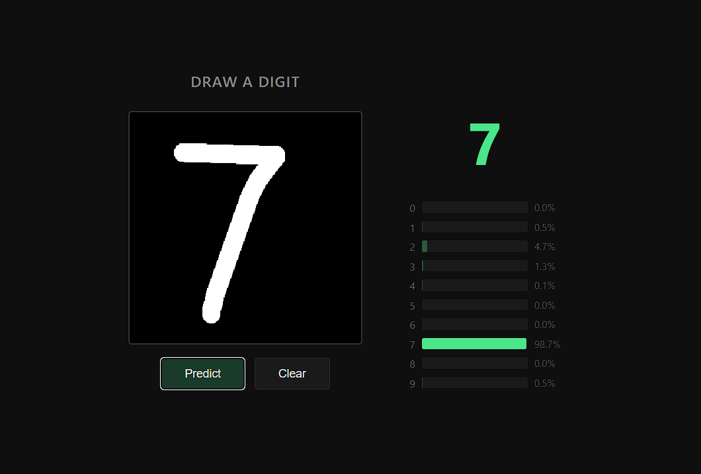

[English](./README.md) | [**Français**](./README.fr.md)

# Réseau de neurones en C

Une bibliothèque en C pour les réseaux de neurones denses (fully connected) appliqués à la classification MNIST, avec une interface web écrite en Go.

**Auteurs :** Mikita Mizerkin, Idirene Daris

**Cours :** TEI S7 - Projet Réseaux de neurones

> **Projet soutenu avec succès devant le jury — note : 19/20, meilleur résultat de la promotion L3 E3A.**
>
> Développé au cours de 10 séances de 4 heures, complétées par du travail personnel à la maison.



## Démarrage rapide

Le dépôt contient un modèle entraîné, ce qui permet de tester l'interface web sans entraîner le réseau au préalable. Go 1.25 ou une version ultérieure est requis.

```bash
cd web
go mod download
go run . -model ../examples/mnist-pngs/mnist_model.bin -addr :4343
```

Ouvrir `http://localhost:4343` dans un navigateur, puis dessiner un chiffre sur le canvas.

## Résultats

Le modèle fourni utilise une architecture `784 → 256 → 128 → 10`. Le rapport du projet présente les résultats suivants sur le jeu de test MNIST après cinq époques d'entraînement :

| Architecture | Précision sur le test | Temps par époque |
|--------------|------------------------|-------------------|
| `784 → 128 → 10` | 93 % | 5 s |
| `784 → 256 → 128 → 10` | 95 % | 12 s |
| `784 → 512 → 256 → 128 → 10` | 96 % | 30 s |

Les benchmarks ont été réalisés sur un Intel Core i5-12500H avec 16 Go de RAM, sur un seul thread et avec une compilation MSVC en mode Release. Les résultats peuvent varier selon la configuration d'entraînement et le matériel.

## Documents du projet

- [Sujet du projet](./TEI-S7-NNv2.pdf)
- [Rapport du projet](./docs/report/index.pdf)

## Prérequis

- Compilateur C (GCC, Clang ou MSVC)
- CMake 3.12+
- libpng
- zlib
- Go 1.25+ (uniquement pour l'interface web)
- dirent (uniquement pour les compilations avec MSVC)

```bash
# Ubuntu / Debian
sudo apt-get install build-essential cmake libpng-dev zlib1g-dev

# macOS
brew install cmake libpng zlib

# Windows avec MSVC (vcpkg)
vcpkg install libpng:x64-windows zlib:x64-windows dirent:x64-windows
```

## Compilation

```bash
mkdir build && cd build
cmake ..
cmake --build .
```

Pour une compilation optimisée :

```bash
cmake .. -DCMAKE_BUILD_TYPE=Release
cmake --build . --config Release
```

## Tests

```bash
cd build
ctest --output-on-failure
```

## Entraînement

Le dépôt contient des données de test prétraitées et un modèle entraîné dans `examples/mnist-pngs/`. Pour réentraîner le modèle depuis zéro, le jeu de données PNG complet est nécessaire :

```bash
git clone https://github.com/rasbt/mnist-pngs mnist-pngs
```

Lancer l'entraînement :

```bash
./build/examples/mnist_train mnist-pngs
```

Plusieurs configurations d'entraînement sont disponibles dans `examples/` :

| Exemple | Activation | Perte | Optimiseur |
|---------|------------|-------|------------|
| `mnist_train.c` | Sigmoid | MSE | SGD |
| `mnist_train_sigmoid_sgd_mse.c` | Sigmoid | MSE | SGD |
| `mnist_train_relu_softmax_adam_cce.c` | ReLU / Softmax | Cross-Entropy | Adam |
| `mnist_train_tanh_softmax_sgd_cce.c` | Tanh / Softmax | Cross-Entropy | SGD |
| `mnist_train_architectures.c` | Sigmoid | MSE | SGD (compare plusieurs architectures) |

## Interface web

L'application Go utilise Gin pour reconnaître en temps réel les chiffres dessinés à la main. Le serveur charge le modèle binaire au démarrage et effectue la propagation avant en Go pur, sans cgo.

L'interface prétraite chaque dessin dans le navigateur en le centrant et en le redimensionnant en 28x28 pixels avant de l'envoyer au serveur.

## Utilisation de la bibliothèque

```c
#include "neuralnet.h"

const size_t layers[] = {784, 256, 128, 10};
Network *net = nn_network_create(layers, 4);

// Configuration de l'entraînement
nn_network_set_training_config(net,
                               ACTIVATION_RELU,
                               ACTIVATION_SOFTMAX,
                               LOSS_CATEGORICAL_CROSS_ENTROPY,
                               OPTIMIZER_ADAM);

nn_network_train(net, train_data, 0.001f, 10);
float acc = nn_network_evaluate(net, test_data);
nn_network_save(net, "model.bin");
nn_network_free(net);
```

Activations disponibles : `SIGMOID`, `RELU`, `SOFTMAX`, `TANH`, `LEAKY_RELU`, `LINEAR`

Fonctions de perte : `MSE`, `MAE`, `BINARY_CROSS_ENTROPY`, `CATEGORICAL_CROSS_ENTROPY`

Optimiseurs : `SGD`, `ADAM`

## Structure du projet

```
nn/
├── docs/
│   ├── report/                # rapport du projet et source LaTeX
│   └── image.png              # capture d'écran de l'interface web
├── include/
│   ├── neuralnet.h            # en-tête principal
│   └── nn/
│       ├── matrix.h           # matrices et vecteurs
│       ├── mnist.h            # chargement de MNIST
│       ├── network.h          # réseau de neurones
│       └── nn_functions.h     # activations, pertes et optimiseurs
├── src/                       # implémentation
├── examples/                  # exemples d'entraînement et modèle fourni
├── tests/                     # tests unitaires et d'intégration
├── web/                       # interface web en Go
│   ├── main.go                # serveur Gin
│   ├── nn/network.go          # inférence en Go
│   ├── templates/index.html  # interface du canvas
│   └── static/app.js          # logique côté client
├── CMakeLists.txt
├── CMakePresets.json
└── TEI-S7-NNv2.pdf            # sujet du projet
```

## Notes techniques

- Le chargeur MNIST utilise un cache binaire (`train.bin`/`test.bin`) pour accélérer les lancements suivants : quelques secondes au lieu de plusieurs minutes pour 70 000 fichiers PNG.
- L'entraînement fonctionne sans allocation dynamique de mémoire pendant les passes avant et arrière grâce à des buffers préalloués.
- Lors du prétraitement, l'interface web centre les chiffres dessinés selon leur centre de masse afin de reproduire la méthode originale de prétraitement de MNIST.
